# Proyecto Dulce Frío

## Descripción
Dulce Frío es un sistema de gestión para la paletería la Michoacana basada en Java
que tiene como objetivo facilitar la gestión y operación del negocio.

## Tecnologías Utilizadas
* [Java 17](https://www.oracle.com/java/technologies/javase/jdk17-archive-downloads.html)
* [JFormDesigner/FlatLag](https://github.com/JFormDesigner/FlatLaf)
* [JPA con Hibernate como implementación](https://hibernate.org/orm/documentation/6.4/)
* [PostgreSQL 15](https://www.postgresql.org/)
* [JasperStudio y JasperReport](https://community.jaspersoft.com/files/file/41-jaspersoft-community-edition/)

## Funciones de los módulos del sistema
* Módulo Inició de Sesión.
  * El sistema permite válidar las credenciales del usuario.
  * El sistema permite verificar los permisos del usuario.
  * El sistema permite mantener la sesión activa.
* Módulo Recuperar Contraseña.
  * El sistema permite válidar que el correo electrónico esté registrado.
  * El sistema permite enviar correo a la dirección especificada con la nueva contraseña.
* Módulo Productos.
  * El sistema permite mostrar la lista de productos.
  * El sistema permite registrar nuevos productos.
  * El sistema permite actualizar la lista de productos.
  * El sistema permite actualizar los productos de la lista.
  * El sistema permite eliminar los productos de la lista.
  * El sistema permite filtrar por:
    * Nombre del producto.
    * Precio del producto.
    * Stock del producto.
* Módulo Empleados.
  * El sistema permite mostrar la lista de empleados.
  * El sistema permite registrar nuevos empleados, asi como crear y asignarle un usuario a cada empleado.
  * El sistema permite actualizar la lista de empleados.
  * El sistema permite actualizar los datos del empleado, asi como los datos del usuario que tiene asignado.
  * El sistema permite eliminar los datos del empleado, asi como el usuario que tiene asignado.
  * El sistema permite filtrar por:
    * Nombre del empleado.
    * Fecha de ingreso del empleado.
* Módulo Usuarios.
  * El sistema permite mostrar la lista de usuarios.
  * El sistema permite actualizar la lista de usuarios.
  * El sistema permite actualizar los datos del usuario, asi como los datos del empleado que tienen asignado.
  * El sistema permite eliminar usuarios de la lista, asi como los empleados que tienen asignado.
  * El sistema permite filtrar por:
    * Nombre del usuario.
    * Nombre del empleado.
    * Nombre del rol del usuario.
* Módulo Ventas.
  * El sistema permite visualizar la lista de ventas.
  * El sistema permite actualizar la lista de ventas.
  * El sistema permite visualizar el reporte de cada una de las ventas.
  * El sistema permite filtrar por:
    * Nombre del empleado que realizo la venta.
    * Fecha de venta de la venta.
* Módulo Carrito De Compras.
  * El sistema permite buscar productos mediante el asistente.
  * El sistema permite agregar productos al carrito.
  * El sistema permite realizar la venta de los productos del carrito.
  * El sistema permite visualizar el reporte de ventas después de realizar la venta.
* Modulo Corte De Caja.
  * El sistema permite mostrar la lista de cortes de caja.
  * El sistema permite actualizar la lista de cortes de caja.
  * El sistema permite abrir la caja ingresando un monto inicial.
  * El sistema permite corte de caja registrando todas las ventas del día.]
  * El sistema permite filtrar por:
    * Nombre del empleado que abrió la caja.
    * Fecha del corte de caja.
    * Tipo de corte de caja.

## Navega por el sistema
1. Pantalla de espera previa a la carga de los recursos.

2. Pantalla de inicio de sesión del sistema.
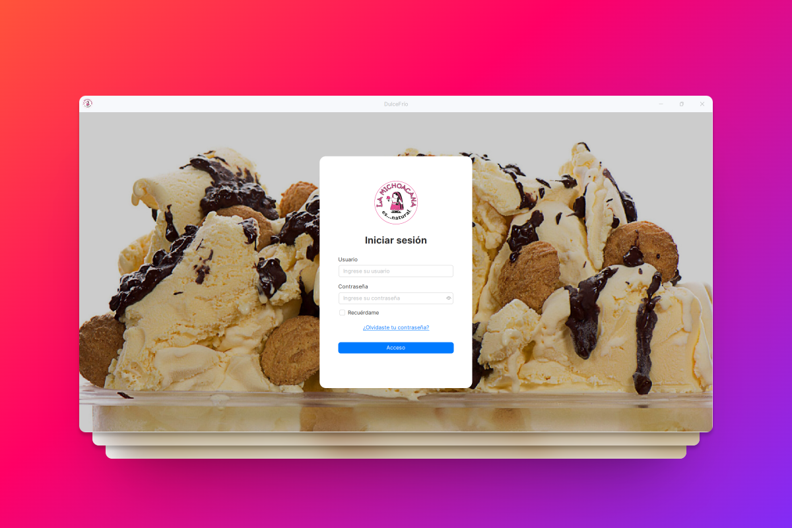
3. Pantalla para recuperar la contraseña.
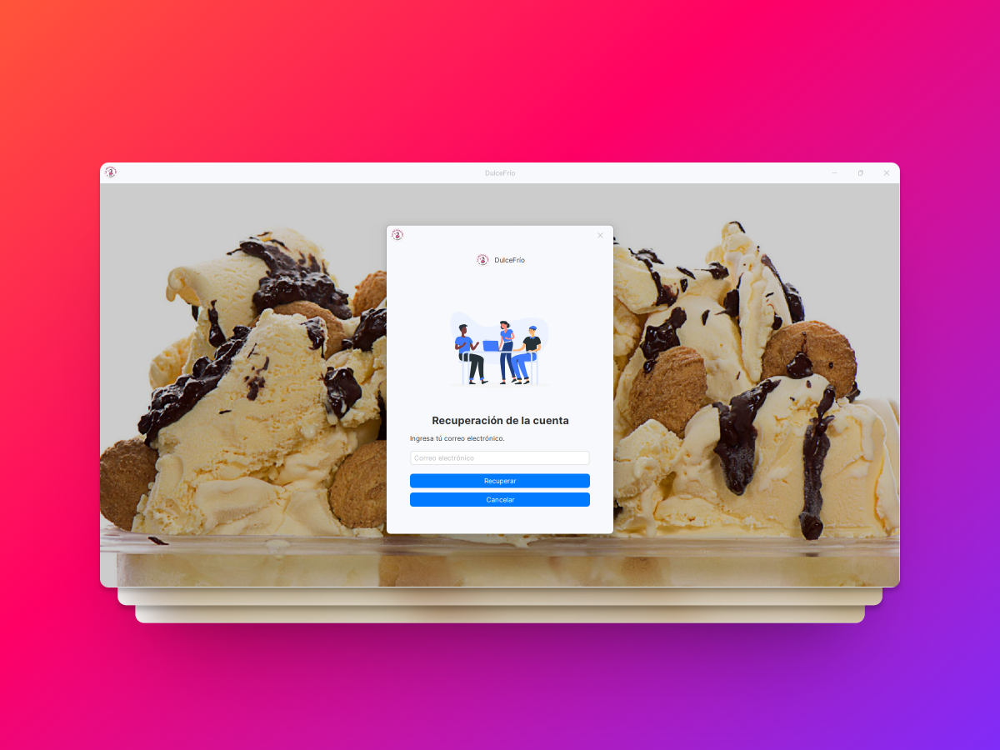
4. Pantalla para ver la lista de productos.
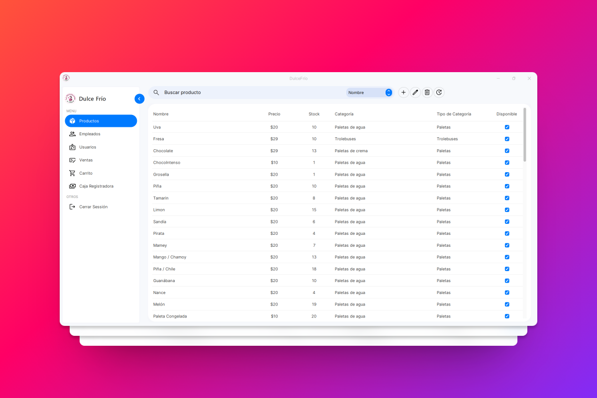
5. Pantalla para agregar productos.
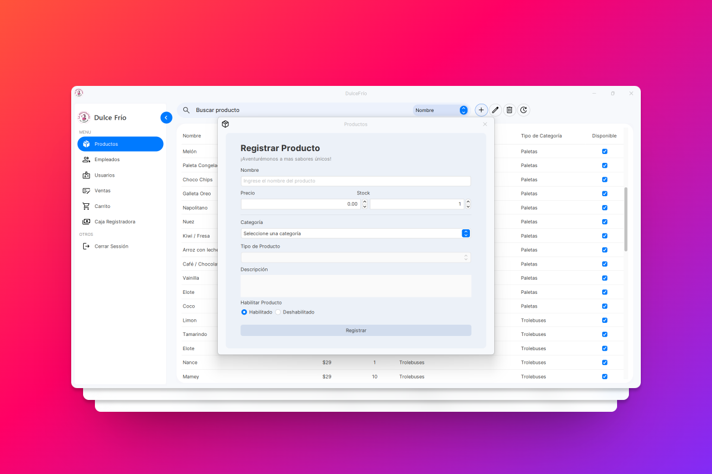
6. Pantalla para actualizar productos.
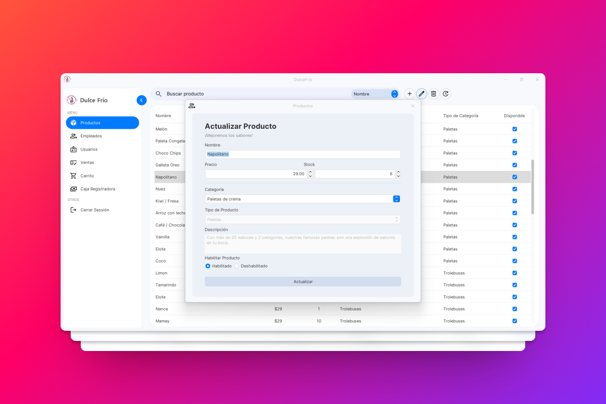
7. Pantalla para ver la lista de empleados.
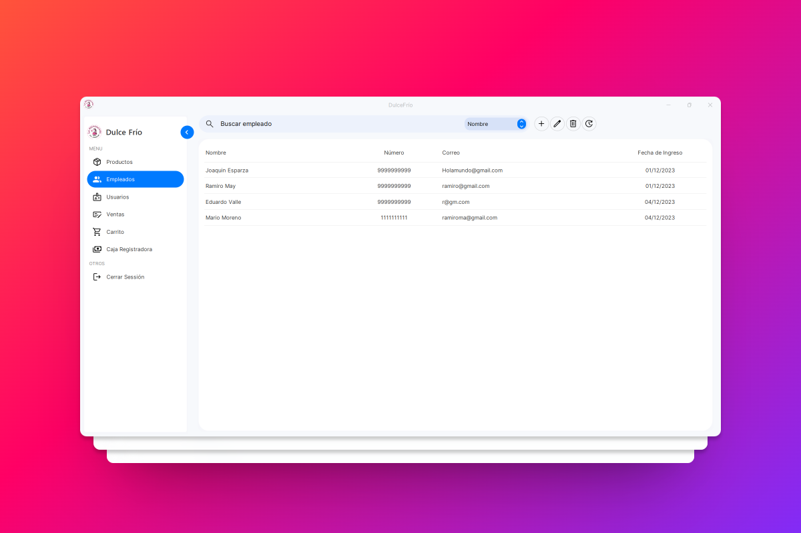
8. Pantalla para agregar empleados.
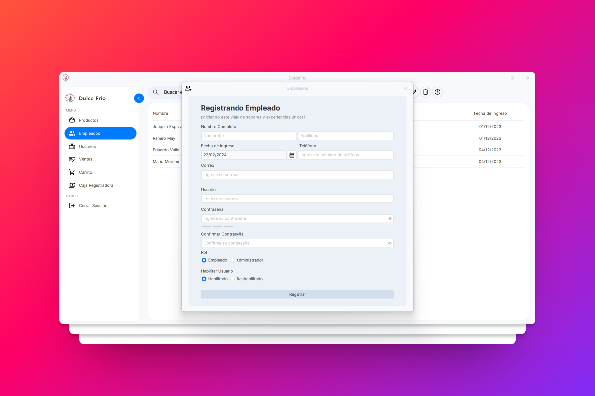
9. Pantalla para actualizar empleados.

10. Pantalla para ver la lista de usuarios.
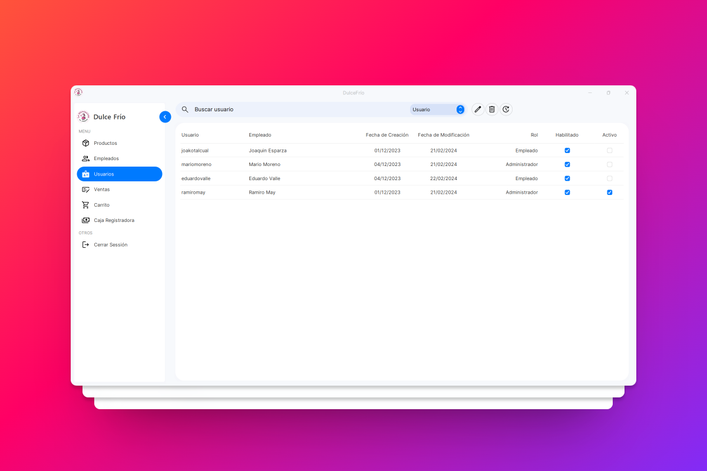
11. Pantalla para actualizar usuario.
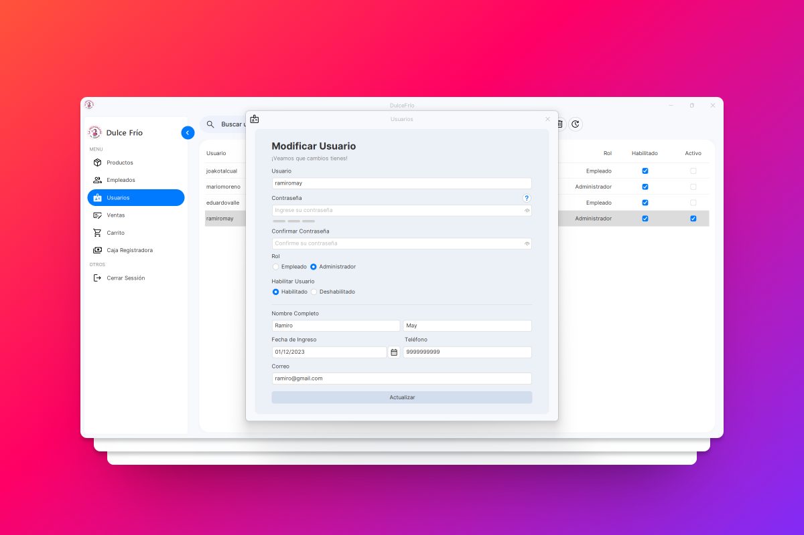
12. Pantalla para ver la lista de ventas.
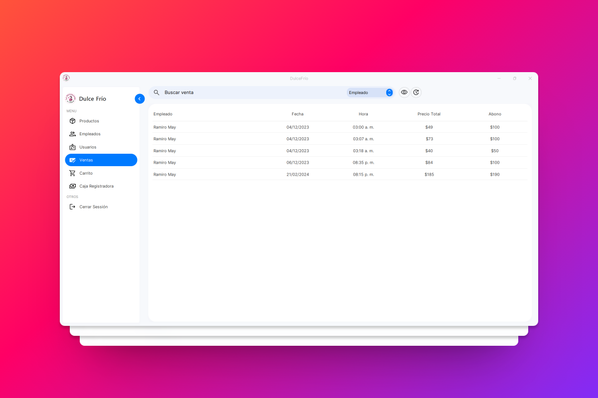
13. Pantalla en modo minimizado de la venta.
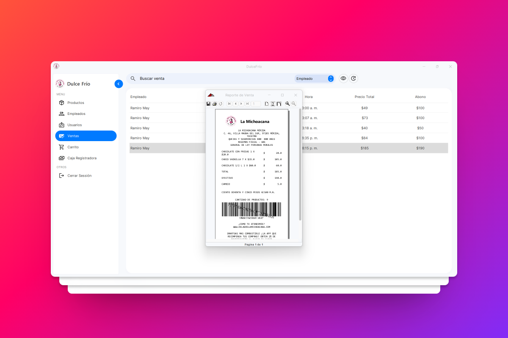
14. Pantalla en modo maximizado de la venta.
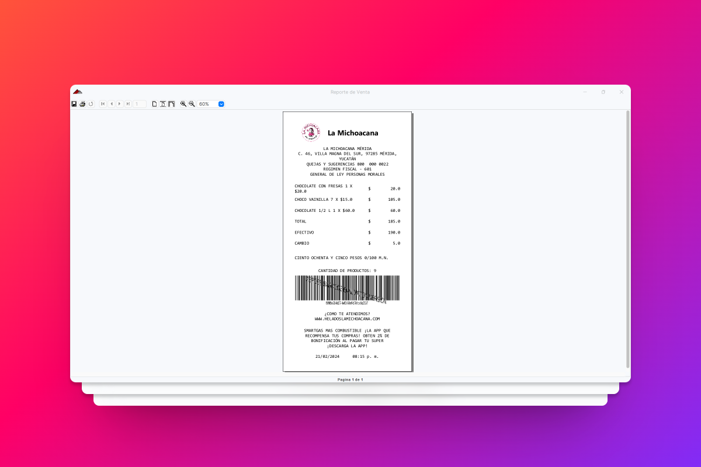
15. Pantalla de carrito de compras.
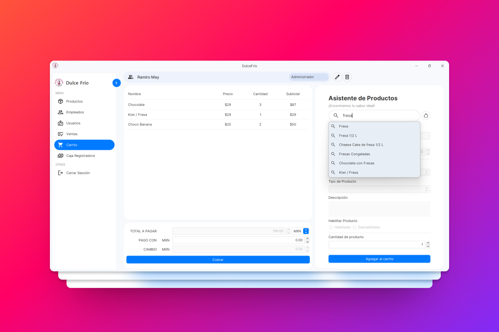
16. Pantalla de corte de caja.
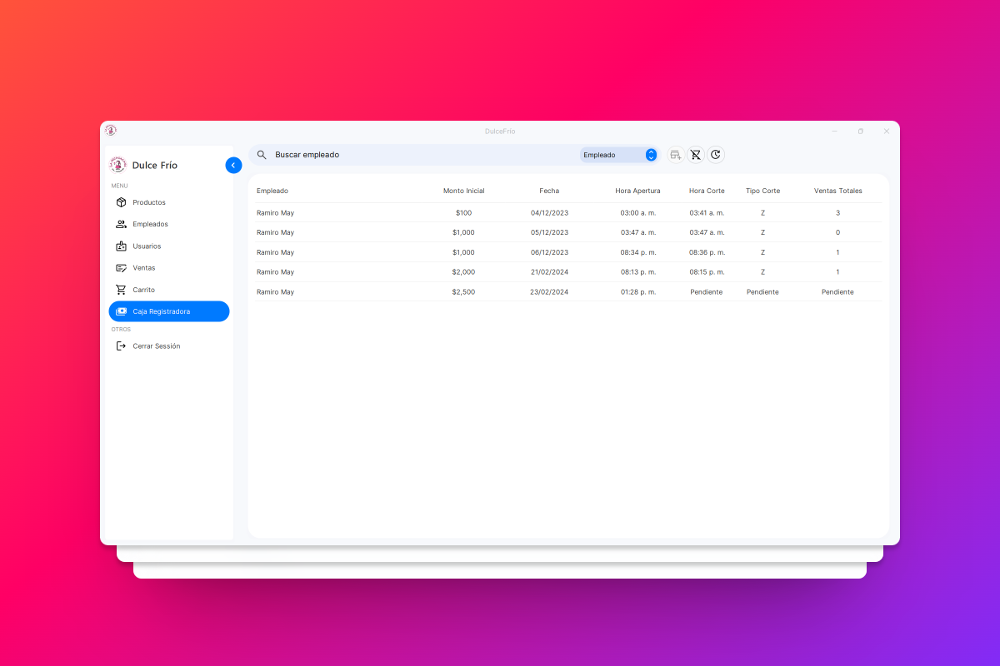